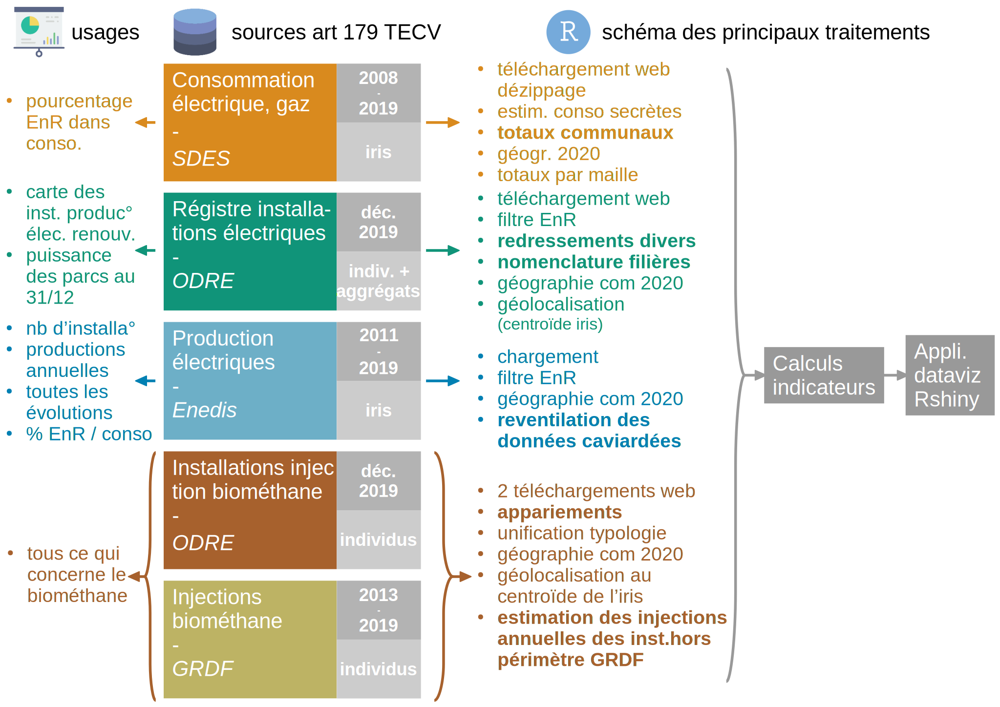

<!-- README.md is generated from README.Rmd. Please edit that file -->

```{r, include = FALSE}
knitr::opts_chunk$set(
  collapse = TRUE,
  comment = "#>",
  fig.path = "man/figures/README-",
  out.width = "100%"
)
```

# enr.reseaux

<!-- badges: start -->
[](https://www.tidyverse.org/lifecycle/#experimental)
[](https://lifecycle.r-lib.org/articles/stages.html#experimental)
<!-- badges: end -->

Le package golem `{enr.reseaux}` sert à visualiser des indicateurs territoriaux de production d'électricité renouvelable et de biométhane. 

## Installation

Vous pouvez installer le package grâce à la commande d'installation d'archive :

``` r
install.packages("~/enr.reseaux_0.0.0.9000.tar.gz", repos = NULL, type = "source")
```

Pour lancer l'application :

```{r example}
library(enr.reseaux)
enr.reseaux::run_app()
```


## A propos

Cette application résulte de la mise en package Golem de l**application EnR de réseaux TEO**](http://apps.datalab.pays-de-la-loire.developpement-durable.gouv.fr/enr_reseaux_teo/), développée par la DREAL Pays de la Loire pour l'observatoire TEO.

Elle s'appuie sur les scripts de datapréparation, publiés dans le [répertoire `collecte` du projet](https://gitlab.com/dreal-datalab/enr_reseaux_teo/-/tree/master/collecte), dont voici la structuration :   
    
  

Le package [**{COGiter}**](https://maeltheuliere.github.io/COGiter/) qui gère les référentiels de géographie administrative (communes, intercommunalités, départements...) doit être installé via devtools et github :    `devtools::install_github("MaelTheuliere/COGiter")`    
tout comme le package [**{tricky}**](http://pachevalier.github.io/tricky/) :   
`devtools::install_github("pachevalier/tricky")`.  

